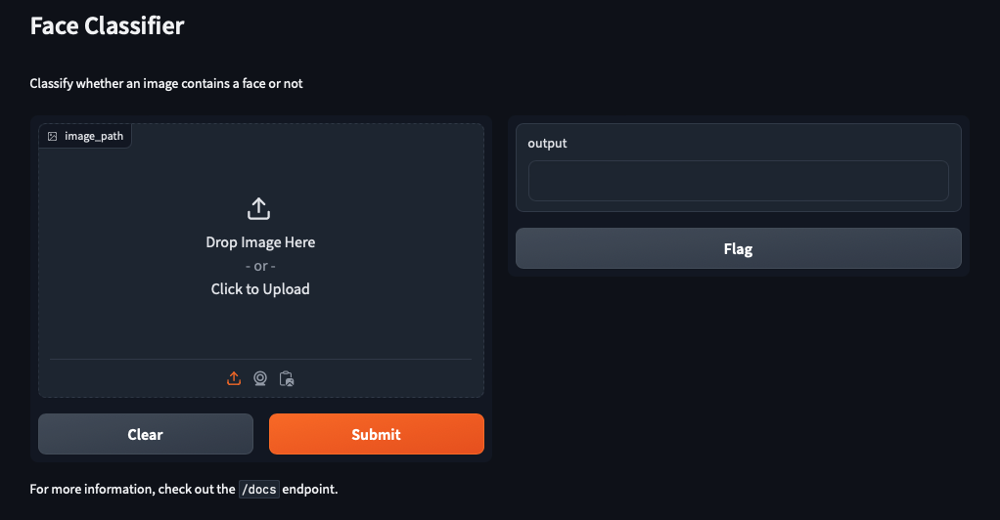

# Gradio demo

This is a demo of the [Gradio](https://www.gradio.app) library, which allows you to quickly create customizable UI components around your ML models (or even arbitrary Python functions).

This demo shows how to use Gradio to create a simple UI for a computer vision model.
In particular, the model is able to recognize whether an image contains a human face or not.
The model used is a pre-trained MobileNetV2 model, which is distributed as part of the Keras library.
The interface lets you upload an image, and then displays the image along with the model's prediction.

## Installation

Be sure to install the project requirements before running the demo:

```bash
pip install -r requirements.txt
```

## Usage

To run the demo, simply run the following command:

```bash
python src/demo.py
```

This will start a Gradio interface on your local machine.
The terminal will display a link to the interface, which you can open in your browser.

```text
Running on local URL:  http://127.0.0.1:7860
```

The interface will look like this:



To stop the server, simply press `Ctrl+C` in the terminal.
